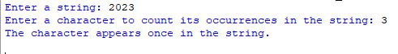

# Character_Occurence
## Description
This program allows users to enter a string and a character. It then counts and displays the number of times the specified character appears in the input string.
## Example
♡ Example 1  
  
♡ Example 2  
  
♡ Example 3  
  
