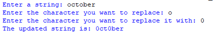

# Character_Replacer
## Description
This program takes user input for a string, a character to replace in that string, and the character to replace it with. It then replaces all occurrences of the specified character in the string and prints the updated string.
## Example

