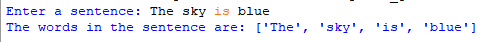
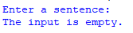

# Split_Sentence
## Description
This program takes a user-input sentence and breaks it down into individual words. It efficiently handles empty or whitespace-only input, providing clear feedback to the user.
## Example
♡ Example 1    
  
♡ Example 2   

