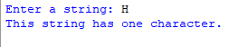
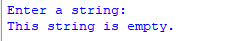
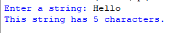

# String_Length
## Description
This program takes user input, calculates the length of the input string, and provides different output based on the length of the string. It handles the cases of a string with more than one character, a string with exactly one character, and an empty string.
## Example
♡ Example 1    
  
♡ Example 2      
  
♡ Example 3    
  
