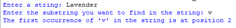
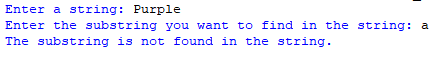

# Substring_Position
## Description
This program is designed to help users locate the position of the first occurrence of a specified substring within a provided string.
However, it's important to note that this program focuses exclusively on identifying the position of the initial instance of the substring in the string and does not provide details about all occurrences of the substring.
## Example
♡ Example 1  
  
♡ Example 2    

